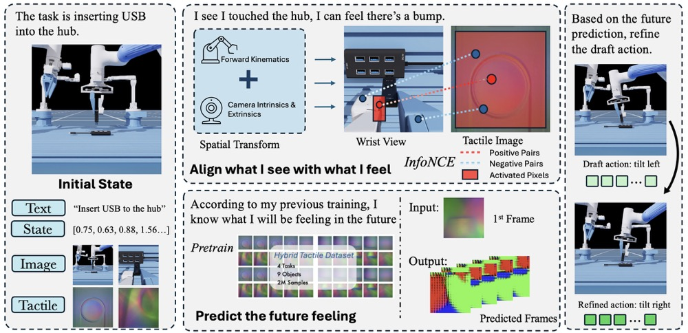
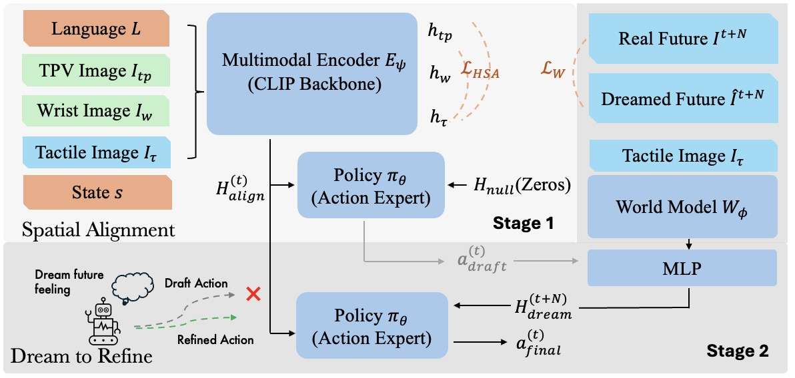
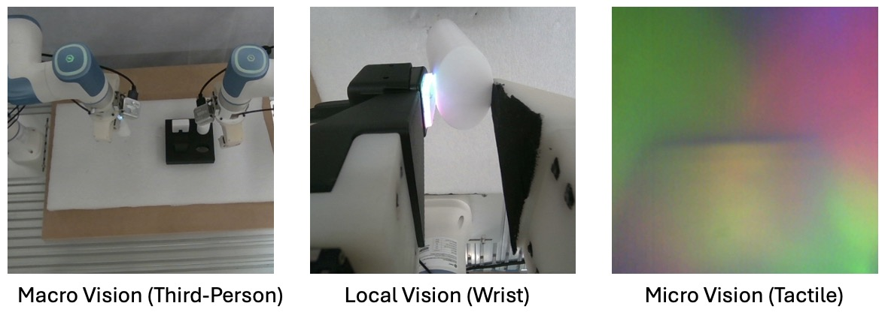
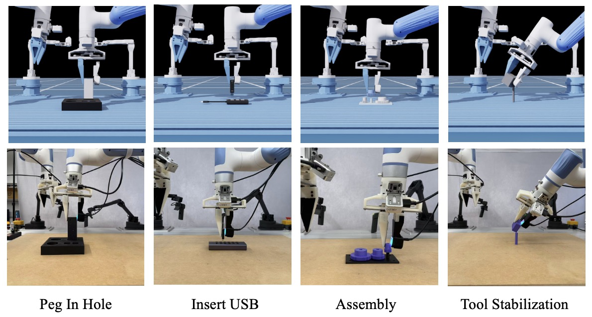
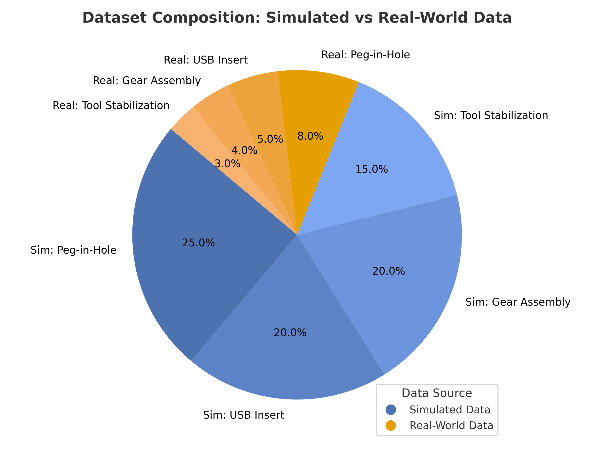
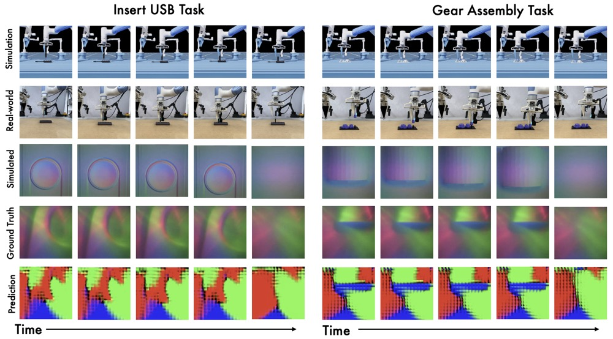
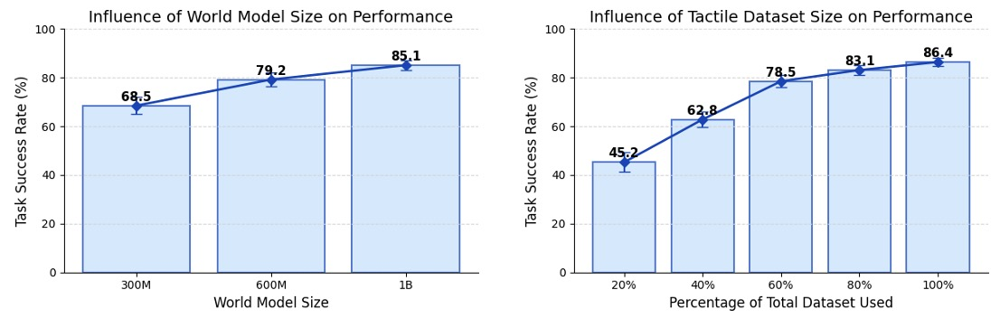
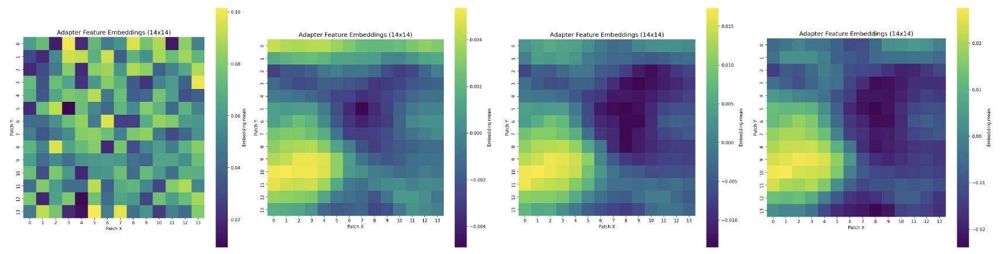

# Learning to Feel the Future: DreamTacVLA for Contact-Rich Manipulation

Official code release for the paper
**"Learning to Feel the Future: DreamTacVLA for Contact-Rich Manipulation"**

[Guo Ye](https://github.com/michaelyeah7)\*, Zexi Zhang\*, Xu Zhao, Shang Wu, Haoran Lu, Shihan Lu, Han Liu
\*Equal contribution. Department of Computer Science, Northwestern University.

[](https://arxiv.org/abs/2512.23864)
[](LICENSE)

<p align="center">
  
</p>

> **Think → Dream → Act.** Each policy step runs in two passes. In the **Think** stage the policy proposes a draft action from the current state and a null tactile prediction. In the **Dream** stage a frozen V-JEPA2 world model forecasts the tactile outcome of that draft action. In the **Act** stage the policy integrates both the real observation and the predicted tactile feedback to refine the action, enabling fine-grained corrections for contact-rich manipulation.

---

## Abstract

Vision-Language-Action (VLA) models have shown remarkable generalization by mapping web-scale knowledge to robotic control, yet they remain blind to physical contact. Consequently, they struggle with contact-rich manipulation tasks that require reasoning about force, texture, and slip. While some approaches incorporate low-dimensional tactile signals, they fail to capture the high-resolution dynamics essential for such interactions. To address this limitation, we introduce **DreamTacVLA**, a framework that grounds VLA models in contact physics by learning to feel the future. Our model adopts a hierarchical perception scheme in which high-resolution tactile images serve as micro-vision inputs coupled with wrist-camera local vision and third-person macro vision. To reconcile these multi-scale sensory streams, we first train a unified policy with a **Hierarchical Spatial Alignment (HSA)** loss that aligns tactile tokens with their spatial counterparts in the wrist and third-person views. To further deepen the model's understanding of fine-grained contact dynamics, we finetune the system with a tactile world model that predicts future tactile signals. To mitigate tactile data scarcity and the wear-prone nature of tactile sensors, we construct a hybrid large-scale dataset sourced from both high-fidelity digital twin and real-world experiments. By anticipating upcoming tactile states, DreamTacVLA acquires a rich model of contact physics and conditions its actions on both real observations and imagined consequences. Across contact-rich manipulation tasks, it outperforms state-of-the-art VLA baselines, achieving up to **95% success**.

---

## Method

<p align="center">
  
</p>

**Two-stage training.** *Stage 1:* a multimodal encoder $E_\psi$ processes macro / local / micro views and is trained with the Hierarchical Spatial Alignment loss $\mathcal{L}_{HSA}$ together with the policy objective $\mathcal{L}_W$, producing a draft action $a^{(t)}_{\text{draft}}$. *Stage 2:* a tactile world model $W_\phi$ is trained to predict future tactile image sequences. At inference the policy "dreams" the future tactile feeling that would result from its draft action and refines the plan into a final action $a^{(t)}_{\text{final}}$.

<p align="center">
  
</p>

**Three-scale visual hierarchy.** Third-person *macro vision*, wrist-camera *local vision*, and high-resolution tactile *micro vision* are fused with the HSA loss, which explicitly grounds what the robot **feels** within what the robot **sees**.

---

## Tasks & Dataset

<p align="center">
  
</p>

We evaluate on four contact-rich tasks: **Peg-in-Hole**, **USB Insert**, **Gear Assembly**, and **Tool Stabilization**.

<p align="center">
  
</p>

The hybrid tactile dataset contains **2M tactile frames** across 4 tasks and 9 objects — 80% high-fidelity simulation + 20% real-world demonstrations.

---

## Results

<p align="center">
  
</p>

Qualitative comparison of predicted vs. ground-truth tactile sequences on Peg-in-Hole and Tool Stabilization.

<p align="center">
  
</p>

Ablation studies on model and data scaling.

---

## Installation

```bash
git clone https://github.com/michaelyeah7/learning-to-feel-the-future.git
cd learning-to-feel-the-future
conda create -n dreamtacvla python=3.10 -y
conda activate dreamtacvla
pip install -r requirements.txt
```

## Data & Pretrained Weights

Set the dataset root once (otherwise `./datasets/` is used):

```bash
export DOBOT_DATA_DIR=/path/to/datasets
```

Place pretrained V-JEPA / V-JEPA2 backbones under `jepa_ckpt/`, e.g. `jepa_ckpt/vitl_peg_e150.pt`. Task entries (paths, episode lengths, camera names) are configured in [`ModelTrain/constants.py`](ModelTrain/constants.py).

## Training

A ready-to-run example for the peg-in-hole task with HSA + CLIP text conditioning:

```bash
bash train_peg.sh
```

Or invoke the trainer directly:

```bash
python ModelTrain/model_train.py \
    --policy_class ACTJEPAAdapter \
    --task_name dobot_peginhole_tac_1107 \
    --ckpt_dir ckpt/my_experiment \
    --vit_ckpt_path jepa_ckpt/vitl_peg_e150.pt \
    --vit_model vitl \
    --clip_model ViT-B-16 --freeze_clip \
    --enable_text --text_prompt "Insert the peg into the hole" \
    --enable_hsa --hsa_weight 1.0 \
    --num_steps 20000 --batch_size 16 --lr 1e-5
```

### Key arguments

| Group | Flag | Purpose |
|---|---|---|
| Required | `--task_name` | Task entry from `ModelTrain/constants.py` |
| Required | `--ckpt_dir` | Output directory for checkpoints |
| Required | `--vit_ckpt_path` / `--vit_model` | V-JEPA tactile backbone (`vitl` or `vitg`) |
| CLIP | `--clip_model`, `--freeze_clip` | RGB encoder variant; freeze recommended |
| Text | `--enable_text`, `--text_prompt` | Language conditioning |
| HSA | `--enable_hsa`, `--hsa_weight` | Hierarchical Spatial Alignment loss |

## Inference

```bash
python experiments/run_inference.py \
    --ckpt_dir ckpt/my_experiment \
    --task_name dobot_peginhole_tac_1107
```

## Data Collection (real robot)

See `scripts/`:

- `4_collect2train_data.py` — convert collected episodes into training format
- `6_dataset_count.py` — dataset statistics

## Visualization

```bash
bash compare_jepa_embeddings.sh        # adapter embedding heatmaps across V-JEPA checkpoints
python visualize_adapter_embeddings.py # single-checkpoint visualization
```

<p align="center">
  
</p>

---

## Project Structure

```
learning-to-feel-the-future/
├── ModelTrain/          # DreamTacVLA training code (policy, world model, HSA loss)
├── dobot_control/       # Robot control + tactile feature extraction
├── experiments/         # Inference / control / launch nodes
├── scripts/             # Data collection utilities
├── examples/            # Minimal usage examples
├── third_party/         # Vendored dependencies (DynamixelSDK, Feetech)
├── robomimic-r2d2/      # Vendored robomimic fork
├── docs/figures/        # README figures
├── train_peg.sh         # Reference training script
└── requirements.txt
```

---

## Citation

```bibtex
@article{ye2025dreamtacvla,
  title  = {Learning to Feel the Future: DreamTacVLA for Contact-Rich Manipulation},
  author = {Ye, Guo and Zhang, Zexi and Zhao, Xu and Wu, Shang and
            Lu, Haoran and Lu, Shihan and Liu, Han},
  journal = {arXiv preprint arXiv:2512.23864},
  year    = {2025}
}
```

## Acknowledgments

This codebase builds on excellent open-source work:
[ACT / Mobile ALOHA](https://github.com/MarkFzp/act-plus-plus),
[V-JEPA / V-JEPA 2](https://github.com/facebookresearch/jepa),
[CLIP](https://github.com/openai/CLIP) and [open_clip](https://github.com/mlfoundations/open_clip),
[robomimic](https://github.com/ARISE-Initiative/robomimic),
[GELLO](https://github.com/wuphilipp/gello_software),
and the Dobot X-Trainer teleoperation stack. See [THIRD-PARTY-LICENSES](THIRD-PARTY-LICENSES) for license details.

## License

Released under the [MIT License](LICENSE). Note that the V-JEPA / V-JEPA 2 pretrained weights are distributed by Meta under **CC BY-NC 4.0** — please consult the upstream repository for the terms governing those weights.

## Contact

For questions, please open a GitHub issue or contact Guo Ye at `guoye2018@u.northwestern.edu`.
